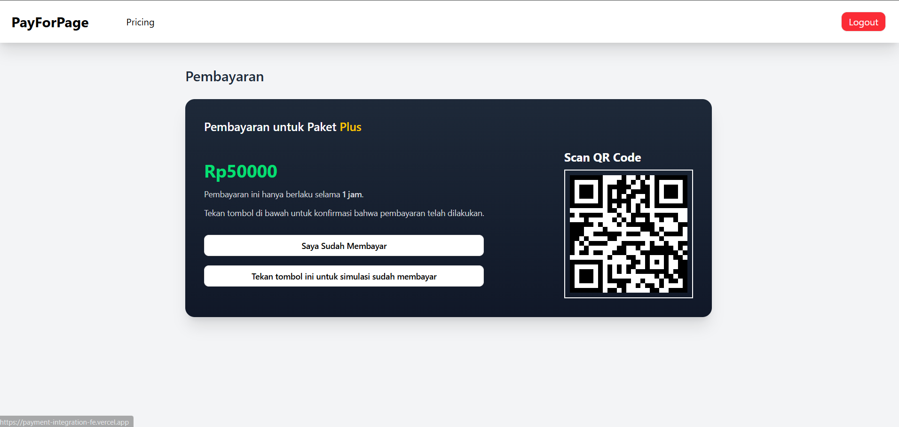
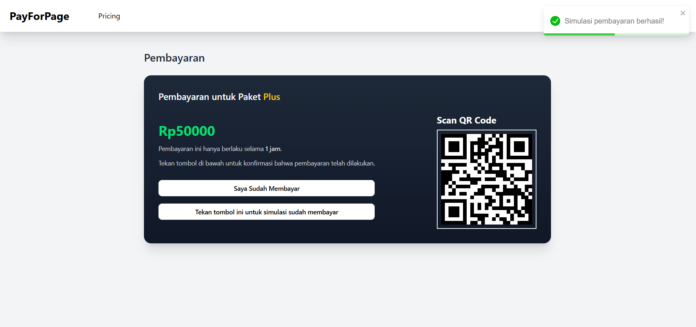
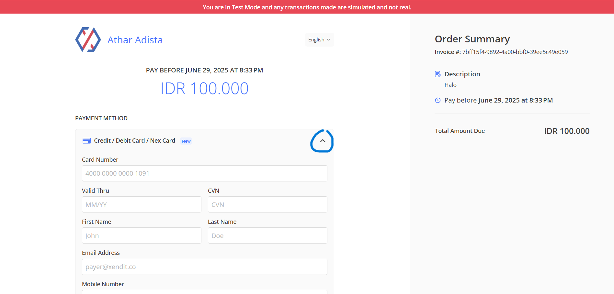
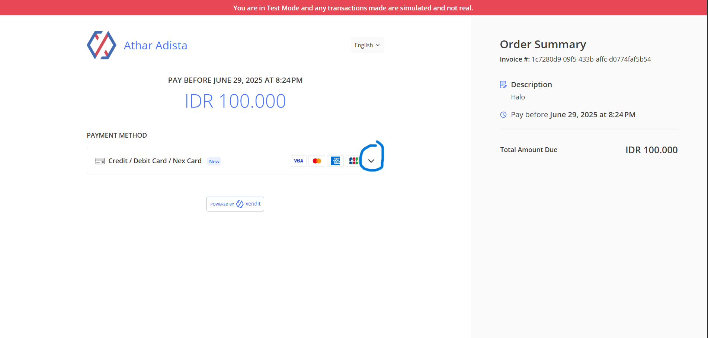
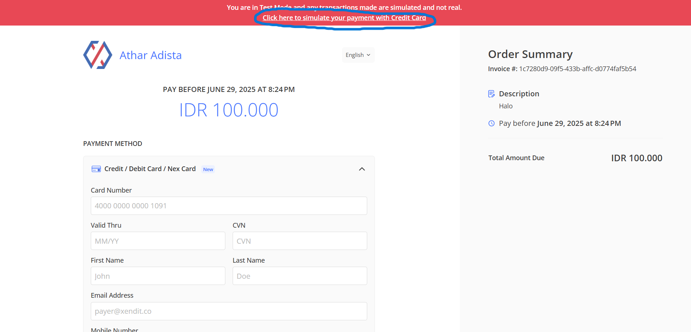

## Link : [Front-end](https://payment-integration-fe.vercel.app)

Cara menggunakan aplikasi:  
1. Register dan lakukan login.
2. Pilih ke Navbar bagian pricing
3. Pilih paket yang ingin dibeli
4. Pilih metode pembayaran yang ingin digunakan
5. Untuk QR dan VA, layar akan menampilkan seperti ini
   
6. Tekan tombol "Tekan tombol ini untuk simulasi sudah membayar"
7. Akan keluar sebuah konfirmasi
    
8. Kemudian tekan tombol "Saya sudah membayar" dan tunggu sampai dialihkan ke main page
9. Untuk pembayaran dengan kredit atau debit, layar akan menampilkan seperti ini dan tekan tombol yang ditandai

10. Kemudian tekan tombol yang ditandai lagi agar dapat melakukan simulasi

11. Kemudian tekan simulasi pembayaran dan tunggu sampai proses selesai, nanti akan di redirect ke main page

jika ada pertanyaan dapat menghubungi saya. Terima kasih